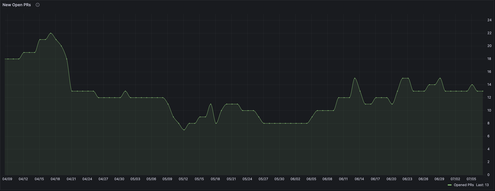

# Pull Requests Problem

There is a problem of monitoring the amount of unprocessed pull requests (hereinafter referred to as PR).

## Solution. InfluxDB

New solution uses [InfluxDB cloud](https://cloud2.influxdata.com/) to keep data about PRs.

PRs are got and parsed to csv format by `gh cli` that is available by default on github runners. This logic is described in [`get_prs.sh`](get_prs.sh) file.

Then csv file is uploaded to InfluxDB with some annotation headers by `influx cli`. This one is installed manually in CI job. This logic is described in [`upload_influx.sh`](upload_influx.sh) file.

Then, using [Grafana Cloud](https://grafana.com/products/cloud/) and [Grafana FlightSQL datasource](https://grafana.com/grafana/plugins/influxdata-flightsql-datasource/) to display the amount of open PRs on [Grafana dashboard](https://grine4ka.grafana.net/goto/drL2bv94R?orgId=1).  

Explicit link to Grafana Dashboard: https://grine4ka.grafana.net/goto/drL2bv94R?orgId=1

### Data

By using InfluxDB I have to use next scheme in CSV file:

```csv
number,closed_at,created_at,timestamp
```

where `timestamp` column is used as a primary key for InfluxDB table.

> ATTENTION
> 
> `timestamp` column is a workaround for the 30 days retention policy for InfluxDB cloud instance.
> 

An example of the data can be seen in [prs.csv](prs.csv) file.

The data is updating regularly, once a day, by deleting bucket, creating it again and then pushing data to the newly created bucket.  
This job is described in github actions workflow in [statistics.yml](../.github/workflows/statistics.yml).

### Graph



InfluxDB select statement to get this data:

```sql
SELECT 
  count(*) as opened,
  days.day
FROM 
  "pull_requests",
  (
  SELECT
    date_bin_gapfill(INTERVAL '1 day', time) as day
  FROM "pull_requests"
  WHERE
  time <= now()
  AND
  time >= '2020-01-01T00:00:00Z'::TIMESTAMP
  GROUP BY
    date_bin_gapfill(INTERVAL '1 day', time)
  ) as days
WHERE
  (days.day >= created_at)
  AND 
  (days.day <= closed_at or closed_at is null)
GROUP BY days.day
ORDER BY days.day
```

## Improvements

1. Get rid of that workaround with additional `timestamp` column and use `created_at` column as a primary key for InfluxDB table.
2. Updating data can be done more accurate - not by deleting everything and pushing again. The simpliest approach can be done by saving the date for last request and get PRs that are updated after that date.

## Alternatives

1. Use Prometheus and [github exporter](https://github.com/githubexporter/github-exporter) to send metrics to it.
	- **pros:** 
		- github-exporter has already implemented some relevant metrics
		- no need to write jobs in GitHub Actions just to gather some metrics
		- Prometheus has built-in support in Grafana
		- Prometheus has its own alertmanager that can help with creating alerts
	- **cons:**
		- github-exporter runs as a separate service that *should* be maintained
		- uses GitHub API that can cause a high load on API services of GitHub
