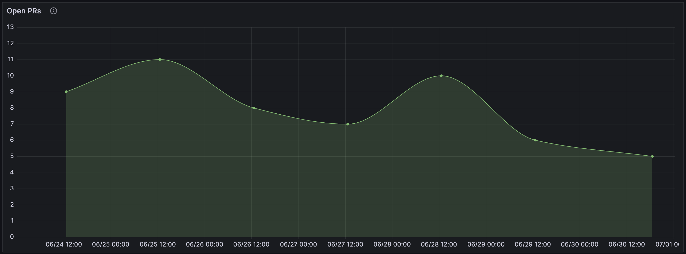

# Pull Requests Problem

There is a problem of monitoring the amount of unprocessed pull requests (hereinafter referred to as PR).

## Solution (rough one)

Roughly this problem is solved by getting the list of open PRs via [GitHub API](https://docs.github.com/en/rest/pulls/pulls?apiVersion=2022-11-28#list-pull-requests) and
putting its amount to a separate [file](measurements.csv).  
Then, using [Grafana Cloud](https://grafana.com/products/cloud/) and [Grafana CSV plugin](https://grafana.com/grafana/plugins/marcusolsson-csv-datasource/) display the amount of open PRs on [Grafana dashboard](https://grine4ka.grafana.net/goto/drL2bv94R?orgId=1).  

Explicit link to Grafana Dashboard: https://grine4ka.grafana.net/goto/drL2bv94R?orgId=1

### Data

Some part of the data in `measurements.csv` is simulated. Just for the convenience.  
The other part is real and is got from [kotlinx.serialization github repo](https://github.com/Kotlin/kotlinx.serialization).

The data is updating regularly, once a day. This job is described in github actions workflow in [statistics.yml](../.github/workflows/statistics.yml).

### Graph

## Improvements

1. Use some TSDB like InfluxDB instead of writing to csv file.  
This solution also helps to fix a drawback of pushing to repo's main branch from a CI/CD job

2. Use [pull request events (openen, closed)](https://docs.github.com/en/webhooks-and-events/webhooks/webhook-events-and-payloads#pull_request) to trigger CI/CD job.  
Do not use GitHub API to request all open PRs because it has a lot of useless traffic and the concept of pagination while retrieving PRs can be very harmful to adopt.  
Should send `1` when PR is opened and `-1` when closed as a value field of the metrics. And then by using query to TSDB get the amount of open PRs.

## Alternatives

1. Use Prometheus and [github exporter](https://github.com/githubexporter/github-exporter) to send metrics to it.
	- **pros:** 
		- github-exporter has already implemented some relevant metrics
		- no need to write jobs in GitHub Actions just to gather some metrics
		- Prometheus has built-in support in Grafana
		- Prometheus has its own alertmanager that can help with creating alerts
	- **cons:**
		- github-exporter runs as a separate service that *should* be maintained
		- uses GitHub API that can cause a high load on API services of GitHub